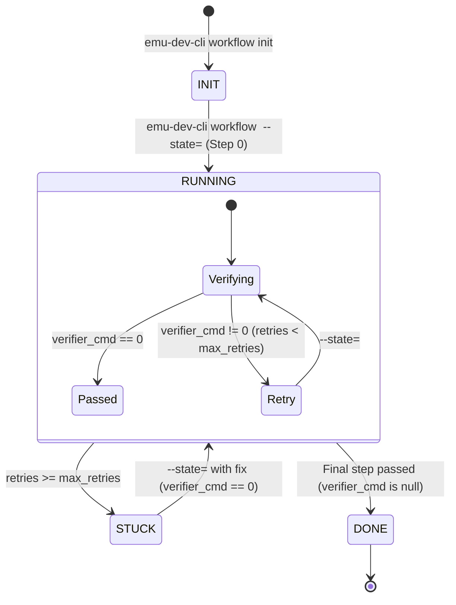

# Declarative Workflow API Reference (YAML: `workflow.yaml`)

This document defines the schema, lifecycle, and API contract for authoring
declarative, hook-enforced workflows in `emu-dev-cli`.

---

## 1. Quick Start: Creating a New Workflow

To create a new workflow:

1. Create a directory: `tools/emu-dev-cli/workflows/<workflow_name>/`
2. Create `workflow.yaml` using
   [`workflow-template.yaml`](./workflow-template.yaml) as your starter.
3. (Optional) Register aliases in `tools/emu-dev-cli/src/commands/workflow.py`
   under `WORKFLOW_ALIASES`.

That's it! `emu-dev-cli workflow <name> init` automatically discovers and runs
`workflow.yaml`. No `main.py` or Python code required.

---

## 2. Top-Level Specification Fields

| Field         | Type     | Required | Description                                                                        |
| :------------ | :------- | :------- | :--------------------------------------------------------------------------------- |
| `name`        | `string` | **Yes**  | Unique identifier for the workflow (e.g. `"git-commit"`, `"hello-world-example"`). |
| `description` | `string` | **Yes**  | One-sentence description shown when running `emu-dev-cli workflow`.                |
| `init`        | `object` | No       | Variables initialized once upon session creation. Supports commands and literals.  |
| `steps`       | `array`  | **Yes**  | Ordered array of step objects defining the workflow lifecycle.                     |

---

## 3. The `"init"` Section: Variable Initialization

The `"init"` section defines variables that are evaluated **once** when a
session is initialized (`emu-dev-cli workflow <name> init`). Results are saved
to the session's state file under `metadata` and are available across all
prompts and commands as `{var_name}`.

### Two Types of Values:

1. **Shell Command**:

   ```yaml
   hello-file:
     cmd: >-
       mkdir -p ~/.cache/emu-dev-cli/workflows/data && mktemp
       ~/.cache/emu-dev-cli/workflows/data/hello-workflow-XXXXXX.txt
   ```

   Executes the command in bash and stores trimmed `stdout` in
   `metadata["hello-file"]`.

2. **Literal Primitive**:
   ```yaml
   max-attempts: 3
   mode: strict
   debug: true
   ```
   Stores the literal value directly in `metadata`.

---

## 4. Variable Interpolation & Security

Any string in `prompt`, `verifier_cmd`, `error_prompt`, `stuck_prompt`, or
`stuck_reason` can use `{placeholder}` syntax.

For commands (`verifier_cmd` and `init` commands), the engine executes commands
via **parameterized execution (`shell=False`)** with arguments tokenized using
`shlex.split`. Variables are interpolated into individual argument tokens in a
single pass, preventing command injection vulnerabilities on both POSIX and
Windows without relying on fragile shell escaping.

### Built-in Variables:

- `{workflow_name}`: Name of the active workflow.
- `{workflow_dir}`: Absolute path to the workflow directory.
- `{state_id}`: Unique 8-character session hex identifier.
- `{step}`: Current 0-indexed step number.
- `{retries}`: Number of consecutive failed verification attempts on the current
  step.
- `{max_retries}`: Max allowed retries for the active step.
- `{verifier_error}`: Trimmed stdout/stderr from failed verifier commands.

### Custom Variables:

- All keys defined in `"init"` (e.g. `{hello-file}`, `{output-dir}`).

---

## 5. Step Specification Fields (`steps`)

Each entry in `steps` defines a discrete phase:

| Field          | Type             | Required | Description                                                                                     |
| :------------- | :--------------- | :------- | :---------------------------------------------------------------------------------------------- |
| `step`         | `integer`        | **Yes**  | 0-indexed step number (`0`, `1`, `2`, ...).                                                     |
| `title`        | `string`         | **Yes**  | Short human-readable title (e.g. `"Write Name"`, `"Run Tests"`).                                |
| `prompt`       | `array<str>`     | **Yes**  | Guidance prompt shown to the agent. The runner automatically appends continuation instructions. |
| `verifier_cmd` | `string \| null` | **Yes**  | Command executed to verify completion. Set to `null` on the terminal completion step.           |
| `max_retries`  | `integer`        | No       | Number of failed attempts before state becomes `STUCK` (default: 3).                            |
| `error_prompt` | `array<str>`     | No       | Prompt displayed when `verifier_cmd` fails and `retries < max_retries`.                         |
| `stuck_prompt` | `array<str>`     | No       | Prompt displayed when `retries >= max_retries`.                                                 |
| `stuck_reason` | `string`         | No       | String recorded in the state YAML when stuck.                                                   |

---

## 6. Execution Lifecycle & Status Flow



### Automatic Continuation Footers

You do **not** need to include `run "emu-dev-cli workflow ..."` in your prompts.
The runner handles this automatically:

- On initialization:
  `Please run 'emu-dev-cli workflow <name> --state=<id>' for the next instructions`
- After normal prompts / error prompts:
  `... and run "emu-dev-cli workflow <name> --state=<id>" for next steps.`
- When stuck:
  `... and run "emu-dev-cli workflow <name> --state=<id>" to resume.`
- On completion: No continuation footer is appended.

---

## 7. Session State Persistence (`STATE-<id>.yaml`)

Every active workflow session is persisted as a human-readable YAML document.
This file tracks progression, failure counters, and runtime metadata across CLI
invocations.

### Storage Location

State files are stored in the user-specific cache directory with restricted
`0600` permissions:

```text
~/.cache/emu-dev-cli/workflows/state/<workflow_name>/STATE-<state_id>.yaml
```

The storage directory can be customized using environment variables (checked in
order of precedence):

1. `EMU_DEV_CLI_WORKFLOW_STATE_DIR`: Overrides the base state directory
   directly.
2. `XDG_CACHE_HOME`: Defaults to `$XDG_CACHE_HOME/emu-dev-cli/workflows/state/`.
3. Default fallback: `~/.cache/emu-dev-cli/workflows/state/`.

### State File Schema

```yaml
state: RUNNING # Lifecycle status: 'INIT', 'RUNNING', 'STUCK', or 'DONE'
step: 1 # Current 0-indexed active step number
retries: 0 # Consecutive verification failures for the current step
stuck_reason: "" # Detailed failure message when stuck (supports multi-line block `|-`)
metadata: # Key-value store initialized during the "init" phase
  hello-file: /home/user/.cache/emu-dev-cli/workflows/data/hello-workflow-123456.txt
  output-dir: /home/user/.cache/emu-dev-cli/workflows/bug_to_markdown
```

### State Fields Reference

| Field          | Type      | Description                                                                                                                 |
| :------------- | :-------- | :-------------------------------------------------------------------------------------------------------------------------- |
| `state`        | `string`  | High-level status: `INIT` (created), `RUNNING` (in progress), `STUCK` (max retries reached), or `DONE` (completed).         |
| `step`         | `integer` | The current active step number (matches `step` in `workflow.yaml`).                                                         |
| `retries`      | `integer` | Count of failed verification attempts on the current step; resets to `0` when a step passes.                                |
| `stuck_reason` | `string`  | Human-readable explanation when stuck. Rendered as a multi-line literal block (`\|-`) if captured output contains newlines. |
| `metadata`     | `object`  | Persistent key-value dictionary populated during `init` and used for `{placeholder}` interpolation across all steps.        |

### CLI Argument Resolution

The `--state` CLI argument is resolved flexibly by the runner:

- **Bare 8-character ID**: `emu-dev-cli workflow <name> --state=38a492be`
- **File Basename**: `emu-dev-cli workflow <name> --state=STATE-38a492be.yaml`
- **Absolute / Relative Path**:
  `emu-dev-cli workflow <name> --state=/path/to/STATE-38a492be.yaml`

The runner searches for existing `.yaml`, `.yml`, or legacy `.json` state files,
defaulting to `.yaml` for new sessions. All updates use POSIX atomic file
replacement (`mkstemp` + `os.replace`) to prevent state corruption.
