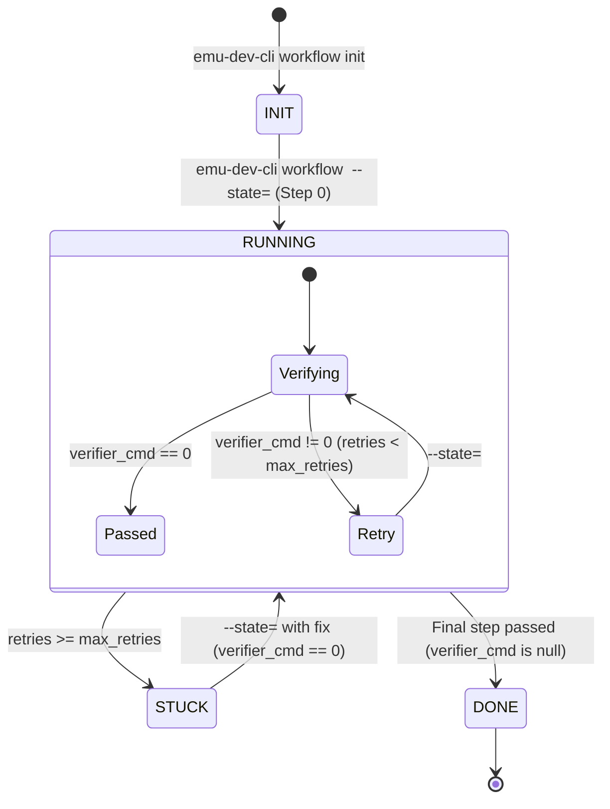

# Declarative Workflow API Reference (YAML: `workflow.yaml`)

This document defines the schema, lifecycle, and API contract for authoring
declarative, hook-enforced workflows in `emu-dev-cli`.

---

## 1. Quick Start: Creating a New Workflow

To create a new workflow:

1. Create a directory: `tools/emu-dev-cli/workflows/<workflow_name>/`
2. Create `workflow.yaml` using
   [`workflow-template.yaml`](./workflow-template.yaml) as your starter.

That's it! `emu-dev-cli workflow <name> init` automatically discovers and runs
`workflow.yaml` matching the workflow's `name`. No `main.py` or Python code
required.

---

## 2. Top-Level Specification Fields

| Field         | Type     | Required | Description                                                                        |
| :------------ | :------- | :------- | :--------------------------------------------------------------------------------- |
| `name`        | `string` | **Yes**  | Unique identifier for the workflow (e.g. `"git-commit"`, `"hello-world-example"`). |
| `description` | `string` | **Yes**  | One-sentence description shown when running `emu-dev-cli workflow`.                |
| `args`        | `array`  | No       | Positional or named CLI arguments accepted by `init`.                              |
| `init`        | `object` | No       | Variables initialized once upon session creation. Supports commands and literals.  |
| `steps`       | `array`  | **Yes**  | Ordered array of step objects defining the workflow lifecycle.                     |

---

## 3. Workflow CLI Arguments (`"args"`)

Workflows can declare CLI parameters accepted during session initialization
(`emu-dev-cli workflow <name> init [arguments...]`).

### Specification Format:

```yaml
args:
  - name: bug-number
    help: "Buganizer bug number (e.g. 553514805 or b/553514805)"
    required: true
```

Parsed arguments are automatically stored in the session's `metadata` and made
available across all prompts and commands as `{arg_name}` (e.g.,
`{bug-number}`). If `required: true`, the CLI will enforce that the argument is
provided when calling `init`.

---

## 4. Generic System Metadata & The Optional `"init"` Section

### Generic System Metadata

The workflow engine automatically initializes and seeds standard, system-managed
metadata values into every session upon `emu-dev-cli workflow <name> init`.
These values are saved directly into the session's state file under `metadata`
and are immediately available across all `init` commands, step prompts,
verifiers, and error handlers:

| Metadata Key | Description                                                                                                                            | Example Value                                             |
| :----------- | :------------------------------------------------------------------------------------------------------------------------------------- | :-------------------------------------------------------- |
| `cache-dir`  | Workflow-specific cache directory (`~/.cache/emu-dev-cli/workflows/<workflow-name>/`), created automatically with `0o700` permissions. | `/home/user/.cache/emu-dev-cli/workflows/bug-to-markdown` |

> [!NOTE] **Extensibility**: The engine is architected to support additional
> generic metadata values in the future (e.g., repository roots, workspace info,
> git branch/commit state, target architecture, or environment identifiers)
> uniformly across all workflows without requiring individual workflows to
> re-implement boilerplate discovery scripts.

### The Optional `"init"` Section: Custom Workflow Variables

Workflows that only need generic scratch space (like `bug-to-markdown`) do not
need an `init` section at all. The `init` section is reserved for custom,
workflow-specific initialization that needs to run once when a session starts.

Evaluated results are merged into the session's `metadata` alongside the generic
metadata.

#### Two Types of Custom Values:

1. **Shell Command**:

   ```yaml
   hello-file:
     cmd: "mktemp {cache-dir}/hello-workflow-XXXXXX.txt"
   ```

   Executes safely via parameterized execution and stores trimmed `stdout` in
   `metadata["hello-file"]`. Commands can reference generic metadata (like
   `{cache-dir}`) and declared CLI `args` (like `{bug-number}`).

2. **Literal Primitive**:
   ```yaml
   max-attempts: 3
   mode: strict
   debug: true
   ```
   Stores the literal value directly in `metadata`.

---

## 5. Variable Interpolation & Security

Any string in `prompt`, `verifier_cmd`, `error_prompt`, `stuck_prompt`, or
`stuck_reason` can use `{placeholder}` syntax.

For commands (`verifier_cmd` and `init` commands), the engine executes commands
via **parameterized execution (`shell=False`)** with arguments tokenized using
`shlex.split`. Variables are interpolated into individual argument tokens in a
single pass, preventing command injection vulnerabilities on both POSIX and
Windows without relying on fragile shell escaping.

### Available Variables Summary

#### 1. Dynamic Execution Variables (Evaluated per step)

- `{step}`: Current 0-indexed step number.
- `{retries}`: Number of consecutive failed verification attempts on the current
  step.
- `{max_retries}`: Max allowed retries for the active step.
- `{verifier_error}`: Trimmed stdout/stderr from failed verifier commands.

#### 2. Session Identification Variables

- `{workflow_name}`: Name of the active workflow.
- `{workflow_dir}`: Absolute path to the workflow directory.
- `{state_id}`: Unique 8-character session hex identifier.

#### 3. Persistent Session Metadata Variables (Stored in `STATE-<id>.yaml`)

- **Generic Metadata**: Pre-seeded by the engine (`{cache-dir}`).
- **CLI Arguments**: Declared in `args` and passed to `init` (e.g.
  `{bug-number}`).
- **Custom Init**: Evaluated from the workflow's `"init"` section (e.g.
  `{hello-file}`).

#### 4. Workflow-Namespaced Variables (Dot Notation for Composed Pipelines)

- `{workflow-name.key}`: References metadata and mapped outputs scoped to a
  specific child workflow (e.g. `{hello-world-example.joke_file}` or
  `{hello-world-joke-rating.final_rating}`).
- Prevents variable collisions across distinct sub-workflows in a pipeline.

---

## 6. Step Specification Fields (`steps`)

Each entry in `steps` defines a discrete phase:

| Field          | Type             | Required | Description                                                                                     |
| :------------- | :--------------- | :------- | :---------------------------------------------------------------------------------------------- |
| `step`         | `integer`        | **Yes**  | 0-indexed step number (`0`, `1`, `2`, ...).                                                     |
| `title`        | `string`         | **Yes**  | Short human-readable title (e.g. `"Write Name"`, `"Run Tests"`).                                |
| `prompt`       | `array<str>`     | **Yes**  | Guidance prompt shown to the agent. The runner automatically appends continuation instructions. |
| `verifier_cmd` | `string \| null` | **Yes**  | Command executed to verify completion. Set to `null` on the terminal completion step.           |
| `max_retries`  | `integer`        | No       | Number of failed attempts before state becomes `STUCK` (default: 3).                            |
| `error_prompt` | `array<str>`     | No       | Prompt displayed when `verifier_cmd` fails and `retries < max_retries`.                         |
| `stuck_prompt` | `array<str>`     | No       | Prompt displayed when `retries >= max_retries`.                                                 |
| `stuck_reason` | `string`         | No       | String recorded in the state YAML when stuck.                                                   |

---

---

## 7. Workflow Composition & Sub-Workflows (`workflow:` steps)

Workflows can be composed into higher-order pipelines by declaring
**sub-workflow steps** directly inside `steps:`.

### Sub-Workflow Step Schema:

```yaml
steps:
  - step: 0
    title: Generate Joke
    workflow:
      name: hello-world-example
      outputs:
        hello-file: joke_file # maps child metadata['hello-file'] -> parent metadata['joke_file']

  - step: 1
    title: Rate Joke
    workflow:
      name: hello-world-joke-rating
      args:
        joke-file: "{hello-world-example.joke_file}" # references output nested in child workflow namespace
      outputs:
        rating-file: final_rating

  - step: 2
    title: Completion
    prompt:
      - "Pipeline finished! Joke generated in '{hello-world-example.joke_file}'
        and rated in '{hello-world-joke-rating.final_rating}'."
    verifier_cmd: null
```

#### Shorthand Syntax:

If a sub-workflow requires no arguments or output mappings, a simple name can be
used:

```yaml
- step: 0
  title: Run Example
  workflow: hello-world-example
```

### Composition Mechanics & Guarantees:

1. **Single State ID Guarantee**: Developers and AI agents only ever invoke the
   parent workflow:

   ```bash
   emu-dev-cli workflow hello-world-joke-pipeline --state=<parent_id>
   ```

   The runner automatically injects the parent command into child step prompts,
   retry prompts, and STUCK messages. Child state IDs never leak to the agent.

2. **Workflow-Namespaced Metadata & Output Scoping**:
   - When a sub-workflow completes, all of its metadata and mapped `outputs:`
     are nested directly inside `metadata[<workflow-name>]` (e.g.
     `metadata["hello-world-example"]["joke_file"]`).
   - Downstream steps and prompts reference these values cleanly using dot
     notation: `{workflow-name.variable}` (e.g.
     `{hello-world-example.joke_file}`).
   - This prevents key collisions when multiple sub-workflows produce common
     outputs (such as `cache-dir`, `output-file`, or `report`).
   - Unambiguous fallback lookup is also supported for convenience.
   - `args`: Can be passed as a named dictionary
     (`joke-file: "{hello-world-example.joke_file}"`) or positional list
     (`["{hello-world-example.joke_file}"]`).
   - `outputs`: Strictly verified upon child completion. If a mapped child key
     is missing from child metadata, `WorkflowOutputError` is raised immediately
     with actionable error details.

3. **Session Provenance & Audit History**:
   - The active child session is recorded under parent `metadata._sub_workflow`
     bound to `parent_step`.
   - When the sub-workflow completes, its record is archived into
     `metadata._sub_workflow_history` preserving full audit trail.

4. **Safety & Cycle Detection**:
   - **Static DAG Check**: Recursion and circular dependencies ($A 	o B 	o A$ or
     $A 	o A$) are detected and rejected at load time.
   - **Runtime Guard**: Execution stack enforces a maximum composition depth of
     5 (`MAX_WORKFLOW_DEPTH`).

---

## 8. Execution Lifecycle & Status Flow



---

## 9. State Management & Persistence (`STATE-<id>.yaml`)

State files are saved per workflow under:

```text
~/.cache/emu-dev-cli/workflows/state/<workflow_name>/STATE-<state_id>.yaml
```

The storage directory can be customized using environment variables (checked in
order of precedence):

1. `EMU_DEV_CLI_WORKFLOW_STATE_DIR`: Overrides the base state directory
   directly.
2. `XDG_CACHE_HOME`: Defaults to `$XDG_CACHE_HOME/emu-dev-cli/workflows/state/`.
3. Default fallback: `~/.cache/emu-dev-cli/workflows/state/`.

### State File Schema

```yaml
state: RUNNING # Lifecycle status: 'INIT', 'RUNNING', 'STUCK', or 'DONE'
step: 1 # Current 0-indexed active step number
retries: 0 # Consecutive verification failures for the current step
stuck_reason: "" # Detailed failure message when stuck (supports multi-line block `|-`)
metadata: # Key-value store seeded with generic metadata and workflow-namespaced outputs
  cache-dir: /home/user/.cache/emu-dev-cli/workflows/hello-world-joke-pipeline
  hello-world-example: # Workflow-specific metadata nested under the child workflow name
    cache-dir: /home/user/.cache/emu-dev-cli/workflows/hello-world-example
    hello-file: /home/user/.cache/emu-dev-cli/workflows/hello-world-example/hello-workflow-123456.txt
    joke_file: /home/user/.cache/emu-dev-cli/workflows/hello-world-example/hello-workflow-123456.txt
  hello-world-joke-rating:
    final_rating: /home/user/.cache/emu-dev-cli/workflows/hello-world-joke-rating/joke-rating-987654.md
```

### State Fields Reference

| Field          | Type      | Description                                                                                                                 |
| :------------- | :-------- | :-------------------------------------------------------------------------------------------------------------------------- |
| `state`        | `string`  | High-level status: `INIT` (created), `RUNNING` (in progress), `STUCK` (max retries reached), or `DONE` (completed).         |
| `step`         | `integer` | The current active step number (matches `step` in `workflow.yaml`).                                                         |
| `retries`      | `integer` | Count of failed verification attempts on the current step; resets to `0` when a step passes.                                |
| `stuck_reason` | `string`  | Human-readable explanation when stuck. Rendered as a multi-line literal block (`\|-`) if captured output contains newlines. |
| `metadata`     | `object`  | Persistent key-value dictionary seeded with generic metadata, args, and custom init values. Used for `{key}` substitution.  |

### CLI Argument Resolution

The `--state` CLI argument is resolved flexibly by the runner:

- **Bare 8-character ID**: `emu-dev-cli workflow <name> --state=38a492be`
- **File Basename**: `emu-dev-cli workflow <name> --state=STATE-38a492be.yaml`
- **Absolute / Relative Path**:
  `emu-dev-cli workflow <name> --state=/path/to/STATE-38a492be.yaml`
